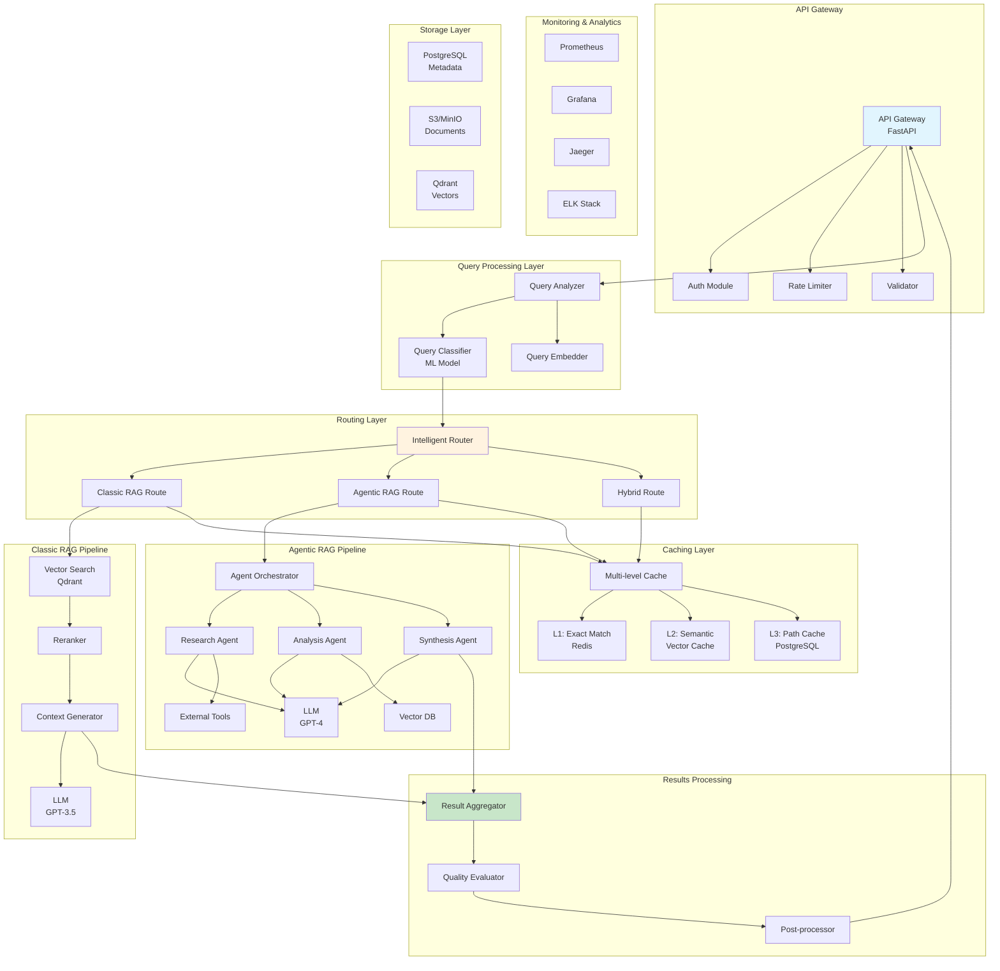
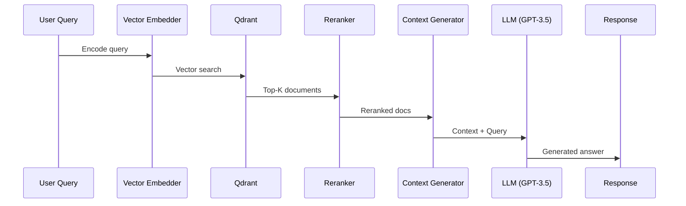
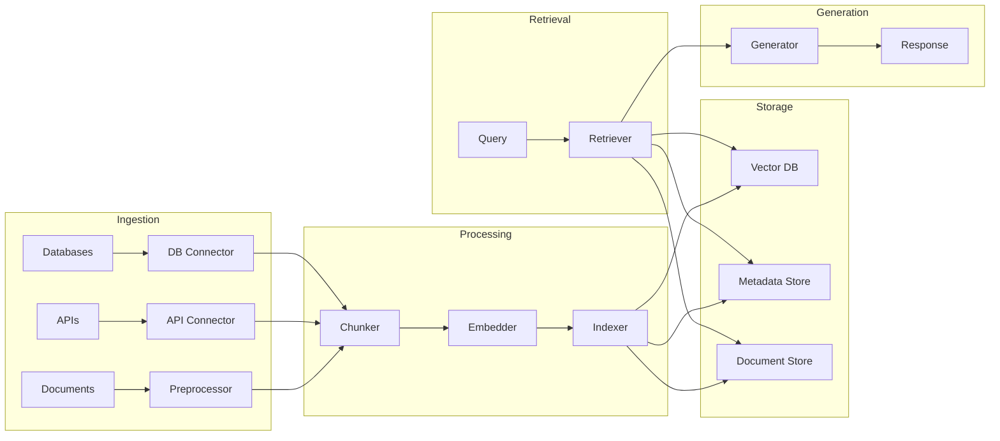

# 🏗️ Архитектура Hybrid RAG System

## Оглавление
- [Обзор системы](#обзор-системы)
- [Основные компоненты](#основные-компоненты)
- [Детальная архитектура](#детальная-архитектура)
- [Поток данных](#поток-данных)
- [Технологический стек](#технологический-стек)
- [Паттерны проектирования](#паттерны-проектирования)
- [Масштабирование](#масштабирование)
- [Безопасность](#безопасность)

## Обзор системы

Hybrid RAG System - это production-ready решение, которое интеллектуально выбирает между классическим и агентным подходами для оптимального баланса между скоростью, стоимостью и качеством ответов.

### Ключевые принципы

1. **Адаптивность** - система автоматически выбирает оптимальную стратегию
2. **Эффективность** - минимизация затрат при сохранении качества
3. **Масштабируемость** - горизонтальное масштабирование всех компонентов
4. **Отказоустойчивость** - каскадные fallback механизмы
5. **Наблюдаемость** - полный мониторинг и трассировка

## Основные компоненты



## Детальная архитектура

### 1. API Gateway Layer

**Компоненты:**
- **FastAPI Server**: Асинхронный REST API сервер
- **Authentication**: JWT-based аутентификация
- **Rate Limiting**: Token bucket алгоритм для ограничения запросов
- **Request Validation**: Pydantic модели для валидации

**Ответственности:**
- Приём и валидация HTTP запросов
- Аутентификация и авторизация
- Rate limiting и защита от DDoS
- Маршрутизация к внутренним сервисам

### 2. Query Processing Layer

**Query Analyzer**
```python
class QueryAnalyzer:
    """
    Анализирует входящий запрос и извлекает метаданные
    """
    def analyze(self, query: str) -> QueryMetadata:
        # Определение языка
        language = self.detect_language(query)
        
        # Извлечение сущностей
        entities = self.extract_entities(query)
        
        # Определение интента
        intent = self.classify_intent(query)
        
        # Оценка сложности
        complexity = self.estimate_complexity(query)
        
        return QueryMetadata(
            language=language,
            entities=entities,
            intent=intent,
            complexity=complexity
        )
```

**Query Classifier**
- ML модель на основе BERT для классификации запросов
- Категории: simple, moderate, complex, multi-hop
- Обучается на исторических данных с feedback loop

**Query Embedder**
- Преобразование запроса в векторное представление
- Использование sentence-transformers для multilingual embeddings
- Кэширование embeddings для повторяющихся запросов

### 3. Routing Layer

**Intelligent Router**
```python
class IntelligentRouter:
    """
    Выбирает оптимальную стратегию обработки запроса
    """
    def route(self, query_metadata: QueryMetadata) -> RoutingDecision:
        # Проверка кэша
        if cached_result := self.check_cache(query_metadata):
            return RoutingDecision(strategy="cache", result=cached_result)
        
        # ML-based решение
        features = self.extract_features(query_metadata)
        strategy = self.ml_model.predict(features)
        
        # Применение бизнес-правил
        strategy = self.apply_business_rules(strategy, query_metadata)
        
        # Проверка доступности ресурсов
        strategy = self.check_resource_availability(strategy)
        
        return RoutingDecision(
            strategy=strategy,
            confidence=self.ml_model.confidence,
            fallback_strategies=self.get_fallbacks(strategy)
        )
```

**Стратегии маршрутизации:**
1. **Classic RAG** - для простых фактологических запросов
2. **Agentic RAG** - для сложных аналитических задач
3. **Hybrid** - комбинация подходов для средней сложности
4. **Cache** - для повторяющихся запросов

### 4. Classic RAG Pipeline



**Особенности:**
- Векторный поиск через Qdrant с HNSW индексом
- BM25 + векторный гибридный поиск
- Cross-encoder reranking для улучшения релевантности
- Динамическое формирование контекста

### 5. Agentic RAG Pipeline

```python
class AgentOrchestrator:
    """
    Координирует работу специализированных агентов
    """
    def orchestrate(self, query: str, metadata: QueryMetadata) -> AgenticResult:
        # Планирование задач
        task_plan = self.planner.create_plan(query, metadata)
        
        # Параллельное выполнение независимых задач
        async_tasks = []
        for task in task_plan.parallel_tasks:
            async_tasks.append(self.execute_task_async(task))
        
        # Сбор результатов
        parallel_results = await asyncio.gather(*async_tasks)
        
        # Последовательное выполнение зависимых задач
        sequential_results = []
        for task in task_plan.sequential_tasks:
            result = await self.execute_task(task, parallel_results)
            sequential_results.append(result)
        
        # Синтез финального ответа
        final_answer = self.synthesis_agent.synthesize(
            parallel_results + sequential_results
        )
        
        return AgenticResult(
            answer=final_answer,
            reasoning_path=task_plan.get_reasoning_path(),
            confidence=self.calculate_confidence(all_results)
        )
```

**Специализированные агенты:**

1. **Research Agent** - поиск и сбор информации
2. **Analysis Agent** - анализ и обработка данных
3. **Synthesis Agent** - объединение и генерация ответа
4. **Verification Agent** - проверка фактов и консистентности
5. **Code Agent** - работа с кодом и техническими запросами

### 6. Caching Layer

**Многоуровневая система кэширования:**

```python
class MultiLevelCache:
    """
    Трёхуровневая система кэширования
    """
    def __init__(self):
        self.l1_cache = RedisCache(ttl=3600)  # 1 час
        self.l2_cache = VectorCache(similarity_threshold=0.95)
        self.l3_cache = PathCache(max_paths=1000)
    
    async def get(self, key: str, embedding: np.ndarray) -> Optional[CachedResult]:
        # L1: Проверка точного совпадения
        if result := await self.l1_cache.get(key):
            return result
        
        # L2: Семантический поиск
        if result := await self.l2_cache.search(embedding):
            return result
        
        # L3: Поиск похожих путей выполнения
        if path := await self.l3_cache.find_similar_path(key):
            return await self.execute_cached_path(path)
        
        return None
    
    async def set(self, key: str, embedding: np.ndarray, 
                  result: Any, execution_path: List[str]):
        await self.l1_cache.set(key, result)
        await self.l2_cache.index(embedding, result)
        await self.l3_cache.save_path(execution_path, result)
```

### 7. Monitoring & Analytics

**Метрики системы:**

```yaml
# Prometheus метрики
metrics:
  # Производительность
  - query_latency_seconds
  - token_consumption_total
  - cache_hit_rate
  - agent_execution_time
  
  # Качество
  - answer_relevance_score
  - user_satisfaction_rating
  - factual_accuracy_score
  
  # Стоимость
  - api_cost_dollars
  - compute_cost_dollars
  - storage_cost_dollars
  
  # Надёжность
  - error_rate
  - fallback_trigger_rate
  - system_availability
```

**Трассировка запросов:**
- Distributed tracing через Jaeger
- Correlation IDs для сквозного отслеживания
- Детальные логи выполнения

## Поток данных



## Технологический стек

### Backend
- **Python 3.11+** - основной язык разработки
- **FastAPI** - асинхронный веб-фреймворк
- **LangChain** - orchestration framework
- **Pydantic** - валидация данных
- **SQLAlchemy** - ORM для работы с БД

### Векторные операции
- **Qdrant** - основная векторная БД
- **Sentence-Transformers** - генерация embeddings
- **FAISS** - backup векторный индекс

### LLM провайдеры
- **OpenAI** (GPT-3.5, GPT-4)
- **Anthropic** (Claude 3)
- **Local Models** через Ollama

### Инфраструктура
- **Docker** - контейнеризация
- **Kubernetes** - оркестрация
- **Redis** - кэширование
- **PostgreSQL** - метаданные
- **MinIO/S3** - хранение документов

### Мониторинг
- **Prometheus** - сбор метрик
- **Grafana** - визуализация
- **Jaeger** - трассировка
- **ELK Stack** - логирование

### CI/CD
- **GitHub Actions** - автоматизация
- **pytest** - тестирование
- **Black/isort/flake8** - линтинг
- **Docker Hub** - registry

## Паттерны проектирования

### 1. Circuit Breaker
```python
class CircuitBreaker:
    """
    Защита от каскадных сбоев
    """
    def __init__(self, failure_threshold=5, recovery_timeout=60):
        self.failure_count = 0
        self.failure_threshold = failure_threshold
        self.recovery_timeout = recovery_timeout
        self.last_failure_time = None
        self.state = "closed"  # closed, open, half-open
    
    async def call(self, func, *args, **kwargs):
        if self.state == "open":
            if self._should_attempt_reset():
                self.state = "half-open"
            else:
                raise ServiceUnavailableError()
        
        try:
            result = await func(*args, **kwargs)
            self._on_success()
            return result
        except Exception as e:
            self._on_failure()
            raise
```

### 2. Retry with Exponential Backoff
```python
class RetryPolicy:
    """
    Политика повторных попыток с экспоненциальной задержкой
    """
    def __init__(self, max_retries=3, base_delay=1, max_delay=60):
        self.max_retries = max_retries
        self.base_delay = base_delay
        self.max_delay = max_delay
    
    async def execute(self, func, *args, **kwargs):
        for attempt in range(self.max_retries):
            try:
                return await func(*args, **kwargs)
            except RetriableError as e:
                if attempt == self.max_retries - 1:
                    raise
                
                delay = min(
                    self.base_delay * (2 ** attempt) + random.uniform(0, 1),
                    self.max_delay
                )
                await asyncio.sleep(delay)
```

### 3. Bulkhead Pattern
```python
class Bulkhead:
    """
    Изоляция ресурсов для предотвращения полного отказа
    """
    def __init__(self, max_concurrent=10):
        self.semaphore = asyncio.Semaphore(max_concurrent)
    
    async def execute(self, func, *args, **kwargs):
        async with self.semaphore:
            return await func(*args, **kwargs)
```

## Масштабирование

### Горизонтальное масштабирование

```yaml
# Kubernetes HPA конфигурация
apiVersion: autoscaling/v2
kind: HorizontalPodAutoscaler
metadata:
  name: hybrid-rag-hpa
spec:
  scaleTargetRef:
    apiVersion: apps/v1
    kind: Deployment
    name: hybrid-rag-api
  minReplicas: 3
  maxReplicas: 50
  metrics:
  - type: Resource
    resource:
      name: cpu
      target:
        type: Utilization
        averageUtilization: 70
  - type: Resource
    resource:
      name: memory
      target:
        type: Utilization
        averageUtilization: 80
  - type: Pods
    pods:
      metric:
        name: requests_per_second
      target:
        type: AverageValue
        averageValue: "1000"
```

### Вертикальное масштабирование

- Оптимизация размеров подов через VPA
- Использование разных типов инстансов для разных компонентов
- GPU узлы для embedding и inference

### Шардирование данных

```python
class DataSharding:
    """
    Распределение данных по шардам
    """
    def __init__(self, num_shards=10):
        self.num_shards = num_shards
        self.shards = [QdrantClient(f"qdrant-{i}") for i in range(num_shards)]
    
    def get_shard(self, key: str) -> QdrantClient:
        shard_id = hash(key) % self.num_shards
        return self.shards[shard_id]
    
    async def search(self, query: str, embedding: np.ndarray) -> List[Document]:
        # Параллельный поиск по всем шардам
        tasks = [
            shard.search(embedding) for shard in self.shards
        ]
        results = await asyncio.gather(*tasks)
        
        # Объединение и ранжирование результатов
        return self.merge_and_rank(results)
```

## Безопасность

### Аутентификация и авторизация

```python
class SecurityManager:
    """
    Управление безопасностью системы
    """
    def __init__(self):
        self.jwt_secret = os.getenv("JWT_SECRET")
        self.encryption_key = os.getenv("ENCRYPTION_KEY")
    
    def authenticate(self, token: str) -> User:
        """JWT аутентификация"""
        try:
            payload = jwt.decode(token, self.jwt_secret, algorithms=["HS256"])
            return User(**payload)
        except jwt.InvalidTokenError:
            raise AuthenticationError()
    
    def authorize(self, user: User, resource: str, action: str) -> bool:
        """RBAC авторизация"""
        return self.rbac.check_permission(user.role, resource, action)
    
    def encrypt_sensitive_data(self, data: str) -> str:
        """Шифрование чувствительных данных"""
        cipher = Fernet(self.encryption_key)
        return cipher.encrypt(data.encode()).decode()
```

### Защита от атак

1. **SQL Injection** - использование параметризованных запросов
2. **XSS** - санитизация входных данных
3. **CSRF** - токены для state-changing операций
4. **Rate Limiting** - защита от DDoS
5. **Input Validation** - строгая валидация всех входных данных

### Compliance

- **GDPR** - право на удаление данных, экспорт данных
- **Data Residency** - хранение данных в определённых регионах
- **Audit Logging** - полное логирование всех действий
- **Encryption** - шифрование данных в покое и в движении

## Оптимизация производительности

### 1. Lazy Loading
```python
class LazyLoader:
    """
    Отложенная загрузка ресурсов
    """
    def __init__(self):
        self._models = {}
    
    def get_model(self, model_name: str):
        if model_name not in self._models:
            self._models[model_name] = self._load_model(model_name)
        return self._models[model_name]
```

### 2. Connection Pooling
```python
class ConnectionPool:
    """
    Пул соединений для эффективного использования ресурсов
    """
    def __init__(self, min_size=10, max_size=100):
        self.pool = asyncpg.create_pool(
            min_size=min_size,
            max_size=max_size,
            command_timeout=60
        )
```

### 3. Batch Processing
```python
class BatchProcessor:
    """
    Пакетная обработка запросов
    """
    def __init__(self, batch_size=32, max_wait_time=0.1):
        self.batch_size = batch_size
        self.max_wait_time = max_wait_time
        self.queue = asyncio.Queue()
    
    async def process_batch(self):
        batch = []
        start_time = time.time()
        
        while len(batch) < self.batch_size:
            try:
                timeout = self.max_wait_time - (time.time() - start_time)
                item = await asyncio.wait_for(
                    self.queue.get(), 
                    timeout=max(0, timeout)
                )
                batch.append(item)
            except asyncio.TimeoutError:
                break
        
        if batch:
            await self._process_items(batch)
```

## Отладка и troubleshooting

### Инструменты отладки

1. **Request Tracing** - полная трассировка каждого запроса
2. **Debug Mode** - подробное логирование в development
3. **Performance Profiling** - профилирование узких мест
4. **Memory Profiling** - отслеживание утечек памяти

### Типичные проблемы и решения

| Проблема | Симптомы | Решение |
|----------|----------|---------|
| Высокая латентность | P95 > 5s | Проверить кэш, увеличить replicas |
| OOM ошибки | Pod restarts | Увеличить memory limits, проверить утечки |
| Низкое качество ответов | User complaints | Проверить prompts, retrain классификатор |
| Частые fallbacks | High fallback rate | Проверить health внешних сервисов |

## Roadmap развития архитектуры

### Q4 2024
- [ ] Реализация полного Agentic RAG pipeline
- [ ] Добавление GraphRAG для работы с графами знаний
- [ ] Интеграция с Anthropic Claude

### Q1 2025
- [ ] Федеративное обучение для privacy-preserving ML
- [ ] Auto-scaling на основе предсказания нагрузки
- [ ] Multi-modal RAG (изображения, аудио)

### Q2 2025
- [ ] Распределённая векторная БД
- [ ] Serverless deployment опция
- [ ] Real-time streaming responses

---

## Контакты архитекторов

- **Техлид**: @hybrid_rag_tech
- **DevOps**: @hybrid_rag_devops
- **ML**: @hybrid_rag_ml

*Последнее обновление: Сентябрь 2024*