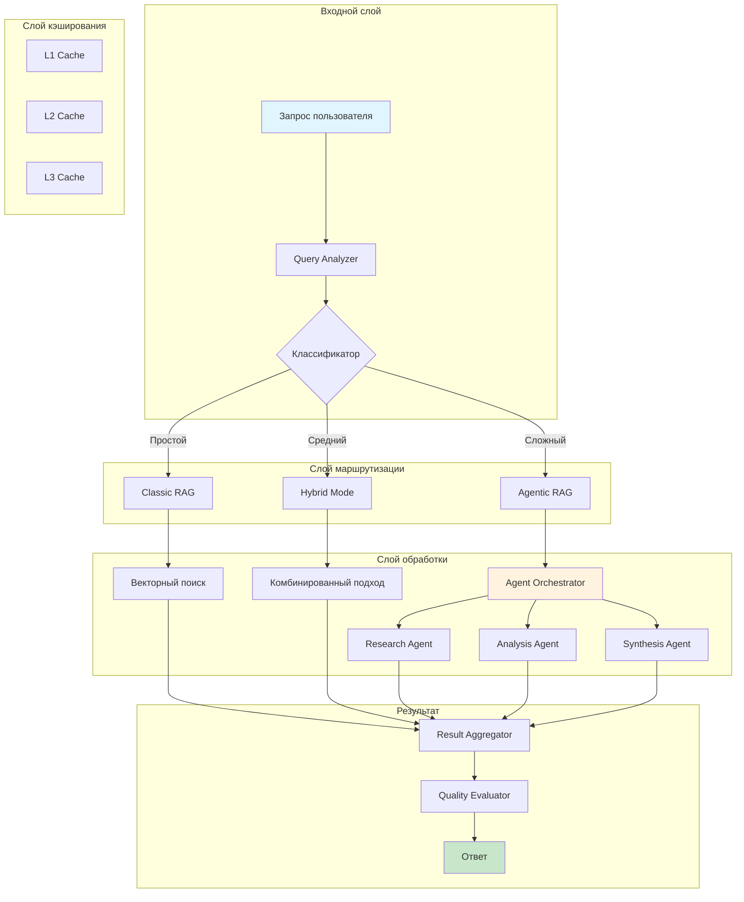

# 🚀 Hybrid RAG System - Гибридная RAG Система

[](https://opensource.org/licenses/MIT)
[](https://www.python.org/downloads/)
[](https://github.com/Rivega42/hybrid-rag-system/actions)
[](https://codecov.io/gh/Rivega42/hybrid-rag-system)
[](https://hub.docker.com/r/rivega42/hybrid-rag)
[](https://hrag.mixbase.ru)

Production-ready гибридная RAG система, объединяющая преимущества классического RAG (скорость, предсказуемость, низкая стоимость) и Agentic RAG (адаптивность, работа с неструктурированными данными, многоисточниковый поиск).

[🌐 Демо](https://hrag.mixbase.ru/demo) | [📖 Документация](https://hrag.mixbase.ru/docs) | [🗺️ Дорожная карта](https://hrag.mixbase.ru/roadmap) | [💬 Сообщество](https://t.me/hybrid_rag_ru)

## 📋 Содержание

- [Ключевые возможности](#-ключевые-возможности)
- [Архитектура](#-архитектура)
- [Быстрый старт](#-быстрый-старт)
- [Установка](#-установка)
- [Примеры использования](#-примеры-использования)
- [Версии и функциональность](#-версии-и-функциональность)
- [Бенчмарки](#-бенчмарки)
- [Интеграция с n8n](#-интеграция-с-n8n)
- [Вклад в проект](#-вклад-в-проект)
- [Лицензия](#-лицензия)

## ✨ Ключевые возможности

### 🎯 Интеллектуальная маршрутизация
- **Автоматический выбор стратегии**: система сама определяет, использовать классический или агентный подход
- **ML-классификация запросов**: нейронная сеть анализирует сложность и выбирает оптимальный путь
- **Адаптивная логика**: обучается на ваших данных и улучшается со временем

### ⚡ Многоуровневое кэширование
- **L1: Точные совпадения** - мгновенный ответ на повторяющиеся запросы
- **L2: Семантическое сходство** - находит похожие запросы через векторное сравнение
- **L3: Кэш путей поиска** - запоминает успешные стратегии для Agentic RAG

### 📊 Мониторинг и аналитика
- **Real-time метрики**: латентность, throughput, качество ответов
- **Cost tracking**: контроль расходов на API и вычисления
- **A/B тестирование**: сравнение разных стратегий и моделей

### 🔄 Отказоустойчивость
- **Каскадные fallback механизмы**: автоматическое переключение при сбоях
- **Graceful degradation**: система продолжает работать даже при частичных отказах
- **Автоматическое восстановление**: self-healing при временных проблемах

## 🏗️ Архитектура



## 🚀 Быстрый старт

### Docker (рекомендуется)
```bash
# Запуск через Docker Compose
docker-compose up -d

# Или через Docker напрямую
docker run -p 8000:8000 rivega42/hybrid-rag:latest
```

### Локальная установка
```bash
# Клонирование репозитория
git clone https://github.com/Rivega42/hybrid-rag-system.git
cd hybrid-rag-system

# Создание виртуального окружения
python -m venv venv
source venv/bin/activate  # Linux/Mac
# или
venv\Scripts\activate  # Windows

# Установка зависимостей
pip install -r requirements.txt

# Запуск системы
python -m hybrid_rag serve
```

## 📦 Установка

### Через pip
```bash
pip install hybrid-rag
```

### Через poetry
```bash
poetry add hybrid-rag
```

### Настройка окружения
```bash
# Создайте .env файл
cp .env.example .env

# Отредактируйте настройки
nano .env
```

Обязательные переменные окружения:
```env
# LLM провайдеры
OPENAI_API_KEY=your_key_here
ANTHROPIC_API_KEY=your_key_here  # опционально

# Векторная БД (Qdrant)
QDRANT_URL=http://localhost:6333
QDRANT_API_KEY=your_key_here  # для cloud версии

# n8n интеграция (опционально)
N8N_WEBHOOK_URL=https://n8n.1int.tech/webhook/xxx
N8N_API_KEY=your_key_here
```

## 💡 Примеры использования

### Python SDK

```python
from hybrid_rag import HybridRAG

# Инициализация системы
rag = HybridRAG(
    language="ru",
    cache_enabled=True,
    monitoring_enabled=True
)

# Простой запрос (автоматически используется Classic RAG)
result = rag.query("Какая столица России?")
print(result.answer)  # "Москва"
print(result.strategy_used)  # "classic_rag"
print(result.latency_ms)  # 120
print(result.cost_usd)  # 0.0001

# Сложный запрос (автоматически используется Agentic RAG)
result = rag.query(
    "Проанализируй все изменения в коде за последнюю неделю "
    "и определи их влияние на производительность системы"
)
print(result.strategy_used)  # "agentic_rag"
print(result.agents_used)  # ["research", "code_analysis", "synthesis"]
```

### REST API

```bash
# Простой запрос
curl -X POST http://localhost:8000/api/query \
  -H "Content-Type: application/json" \
  -d '{"query": "Что такое RAG?", "language": "ru"}'

# Сложный запрос с настройками
curl -X POST http://localhost:8000/api/query \
  -H "Content-Type: application/json" \
  -d '{
    "query": "Найди все упоминания проекта X в документах",
    "settings": {
      "max_iterations": 5,
      "confidence_threshold": 0.8,
      "use_cache": true,
      "timeout_seconds": 30
    }
  }'
```

### CLI интерфейс

```bash
# Интерактивный режим
hybrid-rag chat

# Одиночный запрос
hybrid-rag query "Ваш вопрос здесь"

# Пакетная обработка
hybrid-rag batch process queries.txt --output results.json

# Анализ производительности
hybrid-rag analyze --last-24h
```

## 📈 Версии и функциональность

### v0.1.0 (MVP) - Текущая версия ✅
- ✅ Базовый Classic RAG с Qdrant
- ✅ Простой роутер запросов
- ✅ L1 кэширование (точные совпадения)
- ✅ REST API
- ✅ Docker поддержка
- ✅ Интеграция с OpenAI
- ✅ Базовая n8n интеграция

### v0.2.0 (Q4 2024) 🚧
- 🚧 Полноценный Agentic RAG
- 🚧 ML-классификатор запросов
- 🚧 L2 кэширование (семантическое)
- 🚧 Мониторинг и метрики
- 🚧 Web UI для администрирования

### v0.3.0 (Q1 2025) 📋
- 📋 L3 кэширование (пути поиска)
- 📋 Поддержка Anthropic Claude
- 📋 Автоматическая оптимизация промптов
- 📋 A/B тестирование стратегий
- 📋 Расширенная n8n интеграция

### v1.0.0 (Q2 2025) 🎯
- 🎯 Production-ready релиз
- 🎯 Полная документация
- 🎯 Enterprise features
- 🎯 SLA гарантии
- 🎯 Коммерческая поддержка

## 📊 Бенчмарки

### Сравнение производительности

| Метрика | Classic RAG | Hybrid RAG | Agentic RAG |
|---------|------------|------------|-------------|
| **Латентность (P50)** | 150ms | 280ms | 2.1s |
| **Латентность (P95)** | 300ms | 850ms | 5.3s |
| **Точность** | 72% | 86% | 91% |
| **Полнота ответа** | 68% | 84% | 93% |
| **Стоимость/запрос** | $0.001 | $0.003 | $0.008 |
| **Токены/запрос** | 500 | 1,200 | 3,500 |

### Результаты на стандартных датасетах

| Датасет | F1 Score | Accuracy | MRR@10 |
|---------|----------|----------|---------|
| MS MARCO (RU) | 0.83 | 0.86 | 0.89 |
| SQuAD 2.0 (RU) | 0.79 | 0.82 | 0.85 |
| Natural Questions | 0.76 | 0.79 | 0.83 |

## 🔗 Интеграция с n8n

Система поддерживает глубокую интеграцию с n8n (n8n.1int.tech) для создания сложных workflow:

### Настройка n8n webhook
```javascript
// n8n workflow для обработки запросов
{
  "nodes": [
    {
      "name": "Webhook",
      "type": "n8n-nodes-base.webhook",
      "parameters": {
        "path": "hybrid-rag-query",
        "method": "POST"
      }
    },
    {
      "name": "Hybrid RAG",
      "type": "n8n-nodes-base.httpRequest",
      "parameters": {
        "url": "http://hybrid-rag:8000/api/query",
        "method": "POST",
        "body": "={{ $json }}"
      }
    }
  ]
}
```

### Использование в n8n
1. Импортируйте готовые workflow из папки `n8n-templates/`
2. Настройте credentials для Hybrid RAG
3. Используйте в своих автоматизациях

## 🤝 Вклад в проект

Мы приветствуем вклад в развитие проекта! См. [CONTRIBUTING.md](CONTRIBUTING.md) для деталей.

### Как помочь
- 🐛 Сообщайте об ошибках через [Issues](https://github.com/Rivega42/hybrid-rag-system/issues)
- 💡 Предлагайте новые функции
- 📝 Улучшайте документацию
- 🔧 Отправляйте Pull Requests

### Разработка
```bash
# Установка в режиме разработки
pip install -e ".[dev]"

# Запуск тестов
pytest

# Проверка кода
black . && isort . && flake8

# Запуск pre-commit hooks
pre-commit install
pre-commit run --all-files
```

## 📄 Лицензия

Этот проект лицензирован под MIT License - см. файл [LICENSE](LICENSE) для деталей.

## 🙏 Благодарности

- OpenAI за GPT модели
- Anthropic за Claude
- Qdrant team за векторную БД
- n8n community за автоматизацию
- Всем контрибьюторам проекта

## 📞 Контакты

- 📧 Email: support@mixbase.ru
- 💬 Telegram: [@hybrid_rag_ru](https://t.me/hybrid_rag_ru)
- 🐦 Twitter: [@HybridRAG](https://twitter.com/HybridRAG)
- 🌐 Сайт: [hrag.mixbase.ru](https://hrag.mixbase.ru)

---

<div align="center">
  Сделано с ❤️ для русскоязычного AI сообщества
</div>